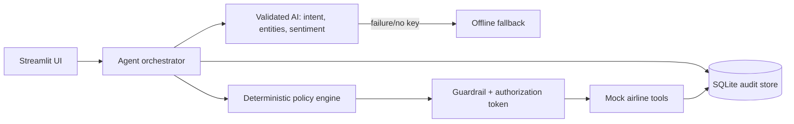
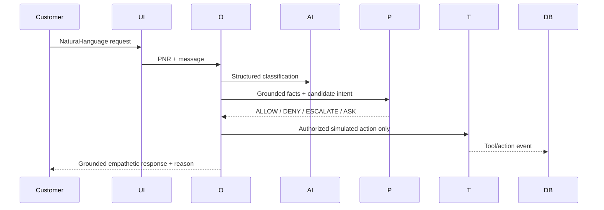

# SkyResolve AI - Airline Disruption Resolution Agent

A presentable, auditable Streamlit agent for AIONOS Assignment 3. It combines genuine optional AI classification with deterministic policy control, production-shaped mocked airline tools, SQLite persistence, and an end-to-end trace. **All airline actions are simulated.**

## Run
```bash
python -m venv .venv && source .venv/bin/activate
pip install -r requirements.txt
streamlit run app.py
```
The app works without a key using a clearly labeled deterministic offline fallback. For genuine live AI classification, copy `.env.example` to `.env`, export `GROQ_API_KEY`, and optionally set `GROQ_MODEL`. Never commit `.env`.

## Architecture



## Responsibility split
- **AI:** intent/entity/sentiment extraction and safe phrasing. It never decides eligibility or invokes tools.
- **Orchestrator:** retrieves context, routes, asks necessary questions, runs policy before tools, and correlates the trace.
- **Policy engine:** sole authority for allow/deny/escalate/clarify decisions.
- **Mock tools:** API-shaped simulation, authorization checks, idempotency, and no unsupported inventory.
- **SQLite:** conversations, messages, classifications, decisions, tool calls, actions, escalations, audit events.

## Supplied inputs, sources, and assumptions
Source 1: Assignment Brief, which requires a working/clickable agent, architecture/process, inputs/sources/assumptions, AI-tools disclosure, GitHub, open Drive demo video plus 15-minute defence, and a 10-slide PPT. Source 2: the two-page Assignment 3 airline data pack, set on Wednesday, 23 September 2026. It is the only business-data and policy source.

Technical assumptions only: SQLite is a suitable prototype store; airline actions are mocked behind realistic interfaces; internal timestamps, UUIDs, correlation IDs, and `SIM-` IDs are implementation metadata. **No alternate-flight inventory was supplied, so the app never invents a flight or seat.** It also does not invent hotel names, payment instruments, refund amounts, or airline integrations.

## Policy decision table
| Condition | Verified outcome |
|---|---|
| Airline cancellation | Customer chooses free next-available rebooking within 24h OR full refund |
| Delay under 3h | ₹500 meal voucher |
| Delay >3h | Meal voucher + lounge |
| Delay >5h | Meal + hotel for delayed hours only |
| Cancellation refund | Full, original method, within 7 business days |
| Voluntary higher-fare flight | Customer pays difference; waiver >₹1,500 needs supervisor |
| Gold/Platinum | Priority rebooking; no extra compensation |
| Legal/formal complaint, beyond-policy request | Immediate human escalation |

The source does not specify equality at exactly 3 or 5 hours, so those synthetic edge cases escalate rather than invent a rule.

## Required scenario walkthroughs
- **Priya (Gold, SK4821X):** offer rebooking/refund choice. A cash or different-method refund and free upgrade cannot execute and go to human review. Anger receives empathy but is not itself a legal escalation.
- **Arvind (Silver, TR1190B):** at 4h, meal + lounge are allowed; hotel is denied. A missed meeting adds no policy benefit.
- **Meher (Platinum, WL7742):** at 6h, meal and six delayed hours of hotel coverage are allowed; a full night is denied. The ₹2,000 waiver exceeds ₹1,500 authority and escalates. No different flight is invented.

## Guardrails and auditability
Pydantic validation, prompt-injection-resistant classifier instructions, PNR ownership checks, policy authorization before every mutation, original-method-only refunds, delayed-hours-only hotel, authority cap, immediate legal/formal complaint escalation, idempotent simulated actions, masked UI contacts, grounded response templates, and a downloadable correlated audit trace.

## Tests and presentation
```bash
python scripts/generate_ppt.py
pytest -q
```
The generated file is `artifacts/Assignment_3_Airline_Resolution_Agent.pptx`; the test verifies exactly 10 slides.

## AI tools used and how
- **Implementation support:** An AI coding assistant supported implementation; final rules, tests, and outputs were verified against the supplied brief and data pack.
- **Application AI:** optional Groq model for structured intent/entity/sentiment classification. A transparent offline fallback keeps the demo runnable with no key. Policy and action authorization remain deterministic.

## 4-6 minute demo script
1. Explain architecture and simulated-action boundary (30s).
2. Priya: run prompt, show choice/escalations and exact policy reason (60s).
3. Arvind: show meal/lounge plus hotel denial (45s).
4. Meher: show delayed-hours hotel and ₹2,000 waiver escalation (60s).
5. Open Audit & trace, download CSV, show AI mode and tests/PPT (60s).
6. State limits and production path (30s). Be prepared for the required 15-minute live defence.

## Limitations and production roadmap
Static supplied data, local SQLite, one-process Streamlit, mocked actions, and no real inventory/authentication. Production would add authenticated customer sessions, live booking/inventory/refund/voucher/hotel APIs, secrets management, human case queues, RBAC, encryption, monitoring, rate limits, and evaluation of classifier/response quality.

## Submission checklist
- [ ] Run app and tests
- [ ] Push to a public GitHub repository
- [ ] Confirm the PPT contains exactly 10 slides
- [ ] Record demo, upload to Google Drive with open access
- [ ] Test GitHub and Drive links in incognito

## Deploy to Streamlit Community Cloud in about two minutes
1. Push this folder to a **public GitHub repository**. Do not add `.env`.
2. In Streamlit Community Cloud choose **Create app**, select the repository/branch, set main file to `app.py`, and choose Python 3.11 (the included `runtime.txt` also requests it). Click **Deploy**.
3. Optional live AI: in the app's **Settings → Secrets**, add `GROQ_API_KEY="..."` and optionally `GROQ_MODEL="llama-3.3-70b-versatile"`, then reboot. Without secrets the labeled offline fallback works.
4. Open the deployed app, run all three quick-start scenarios, and keep the public app URL with the GitHub and open-access Drive video links.

SQLite is created under `data/runtime/` on first request. On Community Cloud this local store is writable but ephemeral across reboots, which is suitable for this demo; a production deployment should use a managed database.

Paste this exact TOML in Streamlit Community Cloud **Settings → Secrets** if live AI is wanted:
```toml
GROQ_API_KEY = "paste-key-here"
GROQ_MODEL = "llama-3.3-70b-versatile"
```
No local setup is required for cloud deployment: upload/push the repository files, select `app.py`, keep Python 3.11, optionally paste the TOML above, and deploy. The app also deploys without secrets in offline-fallback mode.
